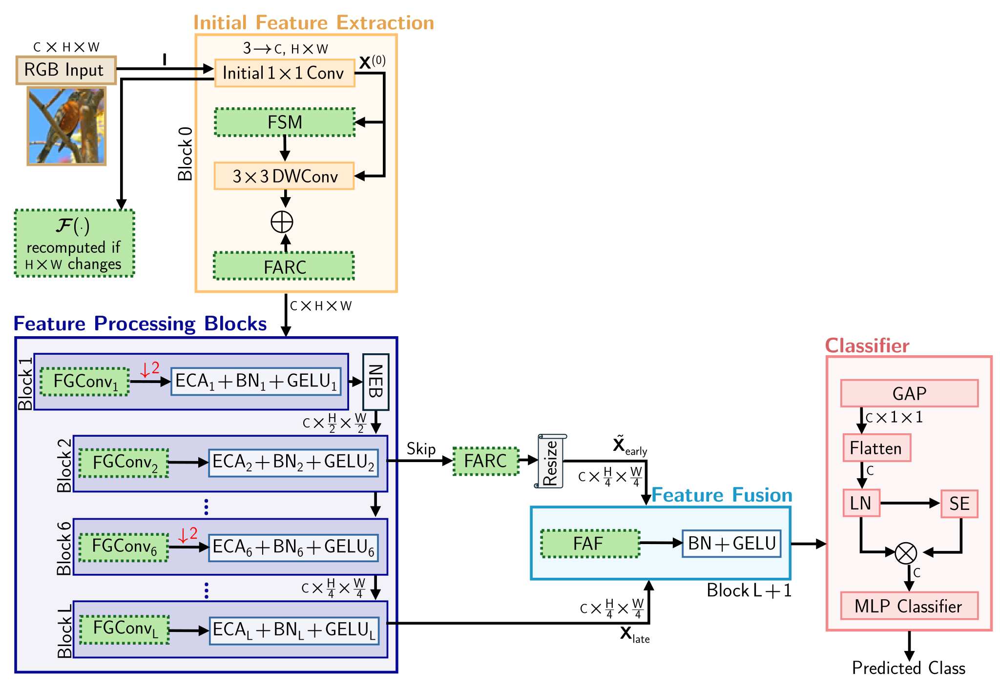
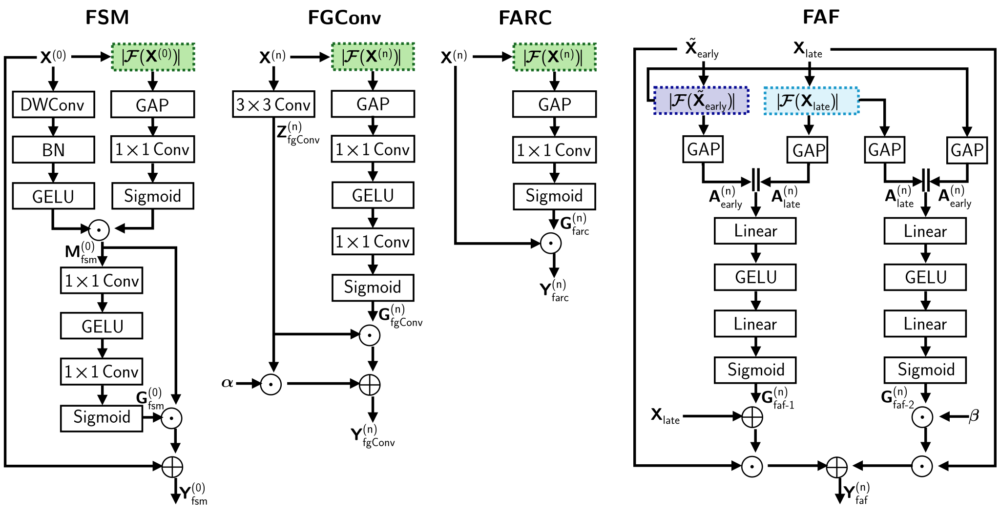
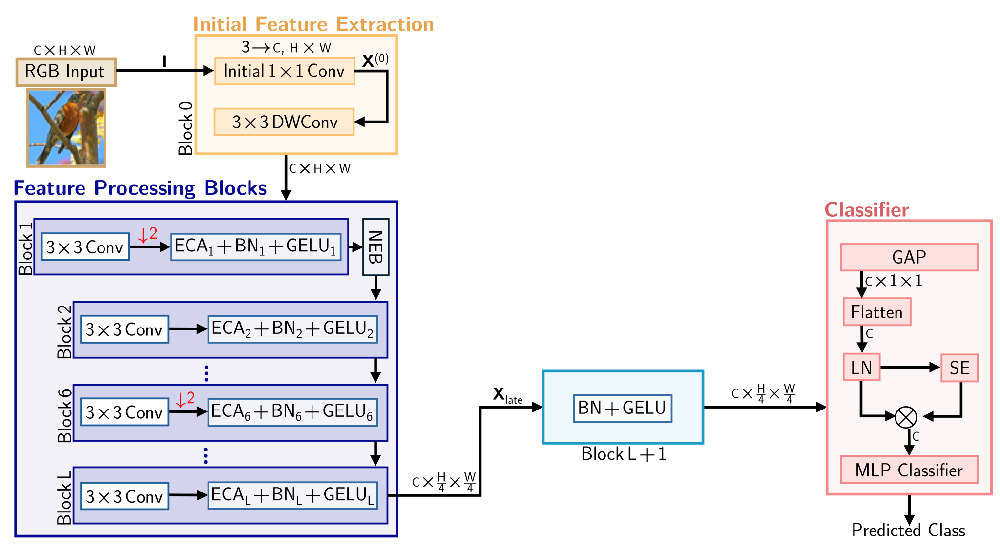

# LiteFA-Net

**LiteFA-Net: A Lightweight Frequency Adaptive Convolutional Neural Network**

---

## Overview
LiteFA-Net is a lightweight CNN that integrates frequency-adaptive conditioning into spatial feature processing to improve feature representation and generalization.

---

## Architecture

  

  <b>Figure: Overview of LiteFA-Net architecture</b>

---

## Modules

  

  <b>Figure: Building blocks of the proposed frequency-adaptive enhancement framework in LiteFA-Net</b>

---

## Spatial Backbone (Lite-Net)

  

  <b>Figure: Overview of Lite-Net architecture</b>

---

## 📄 Full Figures (PDF)

- [LiteFA-Net Architecture](1-Architecture/1-Figures/Lite_FA_Net.pdf)
- [LiteFA-Net Modules](1-Architecture/1-Figures/Lite_FA_Net_Modules.pdf)
- [Lite-Net Architecture](1-Architecture/1-Figures/Lite_Net.pdf)
