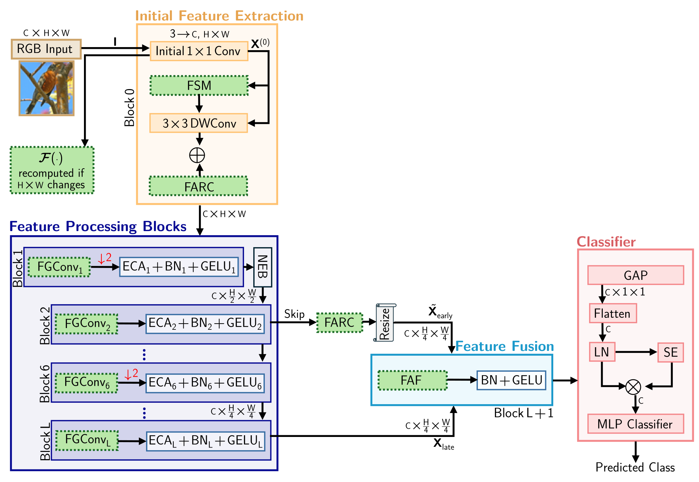
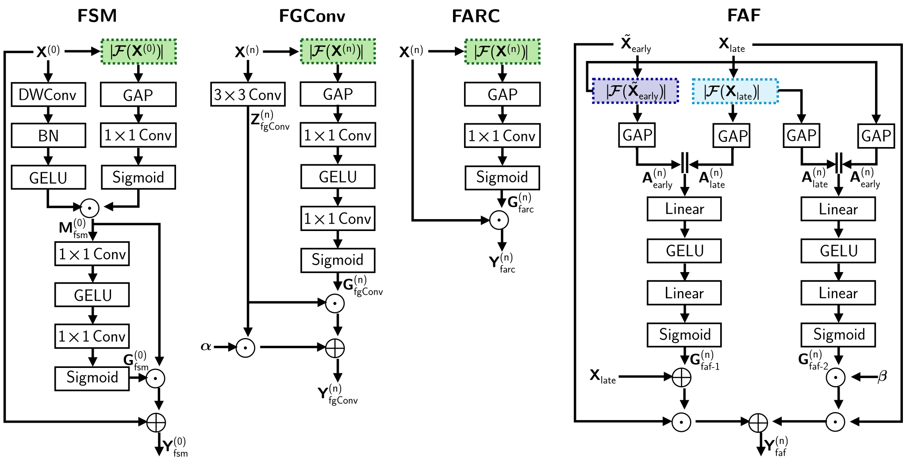
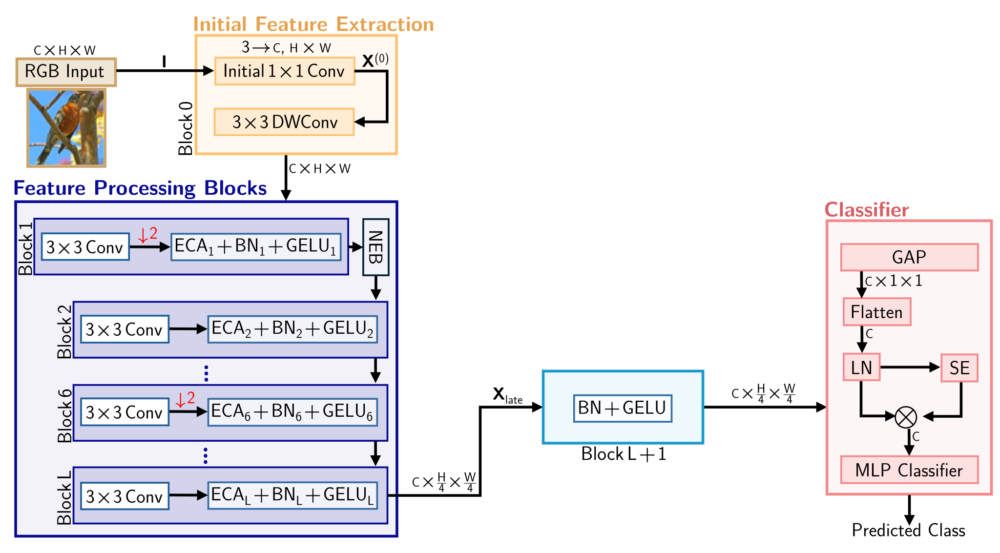

# LiteFA-Net

**LiteFA-Net: A Lightweight Frequency Adaptive Convolutional Neural Network**

---

## Overview

LiteFA-Net is a lightweight CNN that integrates frequency-adaptive conditioning into spatial feature learning to improve feature representation and generalization.

LiteFA-Net augments the spatial backbone (Lite-Net) with a frequency-adaptive enhancement framework consisting of four modules: Frequency Spatial Mixer (FSM), Frequency-Gated Convolution (FGConv), Frequency-Adaptive Recalibration (FARC), and Frequency-Adaptive Fusion (FAF).

The frequency-adaptive enhancement modules use channel-wise globally averaged magnitudes of the 2D DFT coefficients of spatial feature maps as conditioning signals to compute learned frequency-conditioned gating functions that modulate spatial feature representations.

---

## Architecture

  

  <b>Figure: Overview of LiteFA-Net architecture</b>

---

## Modules

  

  <b>Figure: Building blocks of the proposed frequency-adaptive enhancement framework in LiteFA-Net</b>

---

## Spatial Backbone (Lite-Net)

  

  <b>Figure: Overview of Lite-Net architecture</b>

---

## 📁 Repository Structure

- `1-Architecture`

  - Architecture diagrams for LiteFA-Net and its spatial backbone Lite-Net.
  - Architectures of the proposed frequency-adaptive enhancement modules FSM, FGConv, FARC, and FAF.
  - Analyses of the effects of the proposed frequency-adaptive enhancement modules.

- `2-Results`

  - **Main experiments**
    - CIFAR-10, CIFAR-100, and ImageNet-100 classification results.
    - Accuracy-computational efficiency comparisons.
    - Accuracy-inference efficiency comparisons.
    - Plots and experimental logs.

  - **Cumulative ablation study**
    - CIFAR-100 cumulative ablation results.
    - Incremental evaluation of the spatial backbone and frequency-adaptive enhancement modules.
    - Top-1 test accuracy and test-loss plots.
    - Results for Base CNN, Lite-Net-S, FSM, FGConv, FARC, and FAF.
    - Experimental logs and scripts.

  - **FARC frequency descriptor ablation study**
    - Comparison of No FARC, FARC, FARC (GAP(X⁽ⁿ⁾)), and SE.
    - Top-1 test accuracy results for the evaluated configurations.
    - Experimental logs and scripts.

- `3-ImageNet100`

  - Experimental code for ImageNet-100.
  - LiteFA-Net and baseline model implementations.
  - Training and testing scripts.
  - Parsers and utilities.

- `4-CIFAR100`

  - Experimental code for CIFAR-100.
  - LiteFA-Net and baseline model implementations.
  - Training and testing scripts.
  - Parsers and utilities.

- `5-CIFAR10`

  - Experimental code for CIFAR-10.
  - LiteFA-Net and baseline model implementations.
  - Training and testing scripts.
  - Parsers and utilities.

---

## 📄 Architecture Figures (PDF)

- [LiteFA-Net Architecture](1-Architecture/1-Figures/Lite_FA_Net.pdf)
- [LiteFA-Net Modules](1-Architecture/1-Figures/Lite_FA_Net_Modules.pdf)
- [Lite-Net Architecture](1-Architecture/1-Figures/Lite_Net.pdf)

---

## 📊 Classification Results

### CIFAR-10 and CIFAR-100

Top-1 test accuracy (%) of the proposed LiteFA-Net variants. Parameters and MACs are computed at an input resolution of 32 × 32.

| Model | CIFAR-10 Top-1 (%) | CIFAR-100 Top-1 (%) | Params (M) | MACs (G) |
|:---|---:|---:|---:|---:|
| LiteFA-Net-n | 93.25 | 71.07 | 0.30 | 0.05 |
| LiteFA-Net-t | 96.11 | 80.66 | 2.09 | 0.37 |
| LiteFA-Net-S | 96.93 | 82.67 | 4.11 | 0.61 |
| **LiteFA-Net-M** | **97.25** | **83.24** | **7.95** | **1.11** |

### ImageNet-100

LiteFA-Net-S achieves a mean Top-1 test accuracy of **81.29 ± 0.16%** on ImageNet-100 at an input resolution of 64 × 64.

For Run 1, LiteFA-Net-S achieves a Top-1 test accuracy of **81.40%** with **4.16M parameters** and **2.42G MACs**.

---

## 🧪 Ablation Results

### Cumulative Ablation Study

**CIFAR-100**

Top-1 test accuracy (%) is reported for three runs using random seeds 4, 0, and 25, corresponding to Run 1, Run 2, and Run 3, respectively.

| Model Variant | Run 1 | Run 2 | Run 3 | Mean ± SD |
|:---|---:|---:|---:|---:|
| Base CNN (including ECA) | 80.39 | 79.78 | 79.67 | 79.947 ± 0.388 |
| Base CNN + NEB (Lite-Net-S) | 80.56 | 80.40 | 80.63 | 80.530 ± 0.118 |
| Lite-Net-S + FSM | 81.69 | 81.65 | 81.52 | 81.620 ± 0.089 |
| Lite-Net-S + FSM + FGConv | 82.06 | 82.07 | 81.89 | 82.007 ± 0.101 |
| Lite-Net-S + FSM + FGConv + FARC | 82.37 | 82.07 | 82.05 | 82.163 ± 0.179 |
| **Lite-Net-S + FSM + FGConv + FARC + FAF (LiteFA-Net-S)** | **82.67** | **82.44** | **82.43** | **82.513 ± 0.136** |

The cumulative ablation demonstrates progressive performance improvements as the spatial backbone and proposed frequency-adaptive enhancement modules are incrementally integrated.

### FARC Frequency Descriptor Ablation Study

**CIFAR-100**

Top-1 test accuracy (%) is reported for two runs using random seeds 4 and 0, corresponding to Run 1 and Run 2, respectively.

| Model Variant | Run 1 | Run 2 | Mean ± SD |
|:---|---:|---:|---:|
| No FARC | 82.05 | 82.23 | 82.140 ± 0.127 |
| **FARC** | **82.67** | **82.44** | **82.555 ± 0.163** |
| FARC (GAP(X⁽ⁿ⁾)) | 82.11 | 82.17 | 82.140 ± 0.042 |
| SE | 81.95 | 82.13 | 82.040 ± 0.127 |

The FARC ablation evaluates the contribution of the proposed channel-wise frequency descriptor-conditioned recalibration mechanism by comparing the proposed FARC against FARC omission, spatial global average pooling as the conditioning descriptor, and SE.

---

## ⚡ Inference Efficiency Results

Inference latency corresponds to the average time required for a single forward pass using a batch size of 1 after 10 warmup forward passes and averaged over 40 forward passes.

All inference experiments were performed on a single NVIDIA GeForce RTX 4080 SUPER GPU with 16 GB VRAM using PyTorch 2.2.0 and CUDA 12.1.

### CIFAR-10 and CIFAR-100

Input resolution: **32 × 32**

| Model | CIFAR-10 Top-1 (%) | CIFAR-10 Latency (ms) | CIFAR-100 Top-1 (%) | CIFAR-100 Latency (ms) | Params (M) | MACs (G) |
|:---|---:|---:|---:|---:|---:|---:|
| ResNet-110 | 95.08 | 11.18 | 76.63 | 11.47 | 1.73 | 0.26 |
| CVT-7/4 | 94.01 | 4.25 | 76.49 | 4.51 | 3.72 | 0.25 |
| CCT-7/3×2 | 95.04 | 5.43 | 77.72 | 5.50 | 3.85 | 0.29 |
| **LiteFA-Net-t** | **96.11** | **5.19** | **80.66** | **5.32** | **2.09** | **0.37** |

### ImageNet-100: State-of-the-Art Models

Input resolution: **64 × 64**

| Model | Top-1 (%) | Params (M) | MACs (G) | Latency (ms) |
|:---|---:|---:|---:|---:|
| ConvNeXtV2-Base | 72.22 | 87.80 | 1.26 | 14.56 |
| CCT-7/3×1 | 79.32 | 3.98 | 7.56 | 12.72 |
| **LiteFA-Net-S** | **81.40** | **4.16** | **2.42** | **6.24** |

### ImageNet-100: Frequency-Based Models

Input resolution: **64 × 64**

| Model | Top-1 (%) | Params (M) | MACs (G) | Latency (ms) |
|:---|---:|---:|---:|---:|
| GFNet-B | 61.76 | 40.62 | 0.65 | 8.79 |
| ViT-B/16 (AFNO) | 56.66 | 85.74 | 0.92 | 19.68 |
| FFC-ResNet-50 | 71.70 | 28.33 | 0.39 | 43.28 |
| **LiteFA-Net-S** | **81.40** | **4.16** | **2.42** | **6.24** |

---
